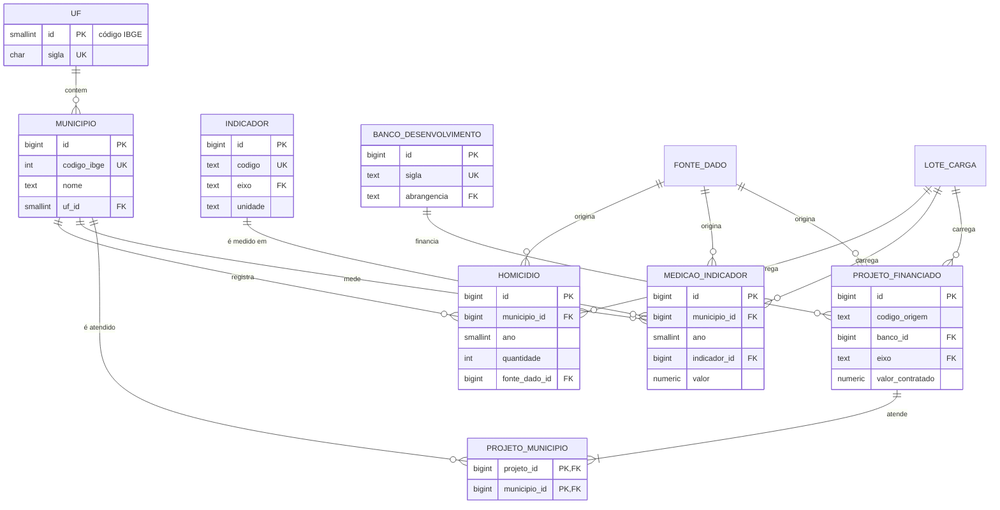
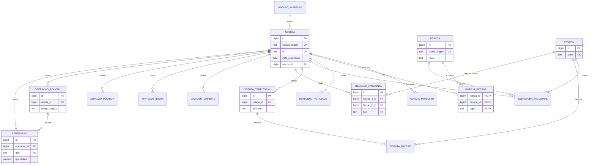

# Modelo Entidade-Relacionamento

Modelo lógico implementado em `db/migrations/`. Colunas completas em
[`DICIONARIO-DADOS.md`](DICIONARIO-DADOS.md). As tabelas de domínio
(`ref_*`), as colunas de proveniência e `criado_em`/`atualizado_em` foram
omitidas dos diagramas para facilitar a leitura.

## Núcleo e Homicídios × Infraestrutura

## Notícias

As tabelas de eixo de notícias também podem referenciar `MUNICIPIO`,
`FACCAO` e `PESSOA` (FK opcional). Esses vínculos ficaram fora do diagrama
para não poluí-lo.

## Decisões de normalização (até a 4FN)

| Situação | Decisão |
|---|---|
| Uma notícia cita **várias pessoas**, **vários municípios** e **vários fatos** de cada eixo, e esses fatos são independentes entre si. | Cada fato multivalorado tem sua própria tabela ligada a `noticia`. Colocar pessoas × facções × apreensões numa tabela só criaria dependências multivaloradas não triviais (violação da 4FN). |
| Uma disputa territorial envolve **várias facções**. | `disputa_faccao` associativa. |
| Um projeto atende **vários municípios**. | `projeto_municipio` associativa. |
| Indicadores de infraestrutura variam por eixo e ainda não são conhecidos um a um. | Catálogo `indicador` + `medicao_indicador` (município × ano × indicador). Evita uma coluna por indicador e mantém a chave `(municipio, ano, indicador, fonte)` como única determinante. |
| Nomes de facção, veículo e pessoa se repetem entre notícias. | Entidades em `nucleo` referenciadas por FK (sem redundância, sem anomalia de atualização). |
| Domínios fechados (papel, tipo de relação, item...). | Tabelas `ref_*` com FK, em vez de `enum` ou texto livre. |
| Proveniência (origem, validação, lote) é atributo **de cada fato** extraído. | As colunas ficam em cada tabela de eixo. Elas dependem da chave do fato, não da notícia. |
| `uf_id` de município é derivável do código IBGE. | Mantido por legibilidade, com `CHECK (codigo_ibge / 100000 = uf_id)` para impedir inconsistência. |
